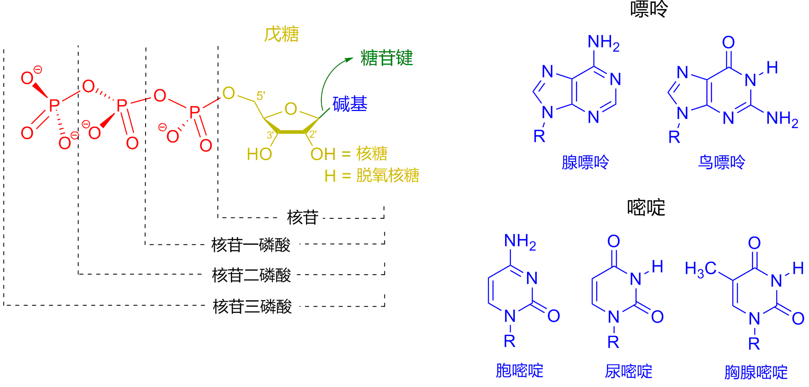

* TOC
{:toc}
---

本文部分内容摘自
* [Wikipedia DNA](https://zh.wikipedia.org/zh-cn/%E8%84%B1%E6%B0%A7%E6%A0%B8%E7%B3%96%E6%A0%B8%E9%85%B8)
* [结构生物学](https://www.bilibili.com/video/BV1rK411n7UE?p=11)

## DNA 与 RNA

### DNA 含义
* DNA (short for Deoxyribonucleic Acid) 中文意思是脱氧核糖核酸，是一种生物小分子，可组成遗传指令。主要功能是信息储存。其中包含的指令，是建构细胞内其他的化合物，如蛋白质与核糖核酸所需。带有蛋白质编码的DNA片段称为基因。其他的DNA序列，有些直接以本身构造发挥作用，有些则参与调控遗传信息的表现。 

### DNA 的构成
* DNA是一种长链聚合物，组成单位称为核苷酸，而糖类与磷酸借由酯键相连，组成其长链骨架。每个糖单位都与四种碱基里的其中一种相接，这些碱基沿着DNA长链所排列而成的序列，可组成遗传密码，是蛋白质氨基酸序列合成的依据。读取密码的过程称为转录，是根据DNA序列复制出一段称为RNA的核酸分子。

* DNA 与染色体（Chromosomes）：在细胞内，DNA能组织成染色体结构，整组染色体则统称为基因组（genome）。染色体在细胞分裂之前会先行复制，此过程称为DNA复制。对真核生物，如动物、植物及真菌而言，染色体是存放于细胞核（nucleus）内；对于原核生物而言，如细菌，则是存放在细胞质中的拟核里。染色体上的染色质蛋白，如组蛋白（histone），能够将DNA组织并压缩，以帮助DNA与其他蛋白质进行交互作用，进而调节基因的转录。 

* 对人类而言，有46条染色体，而每个染色体都包含一个DNA分子。

### DNA 和 RNA 的物理化学性质
* 核苷酸（nucleotide）是核酸的基本组成单位。或者说，核苷酸是核酸的单体。
* 含氮碱基（nitrogenous base）： 腺嘌呤（A）、鸟嘌呤（G）、胞嘧啶（C）、胸腺嘧啶（T）和尿嘧啶（U）
* 五碳糖：脱氧核糖 or 核糖
* 核苷酸 = 含氮碱基 + 五碳糖 + 一个或多个磷酸基团

Figure 1

## DNA 和 RNA 的碱基区别

Figure 2

* ATCG：两股脱氧核糖核酸长链上的碱基以氢键相互吸引，使双螺旋形态得以维持。这些碱基可分为两大类，以5角及6角杂环化合物组合而成的一类称为嘌呤；只有一个6角杂环的则称为嘧啶。组成脱氧核糖核酸的碱基，分别是腺嘌呤（adenine，缩写A）、胞嘧啶（cytosine，C）、鸟嘌呤（guanine，G）与胸腺嘧啶（thymine，T）。碱基、糖类分子与磷酸三者结合之后，便成为完整的核苷酸。

* 关于T和甲基化：还有一种碱基称为尿嘧啶（uracil，U），此种碱基比胸腺嘧啶少了一个位于环上的甲基，一般出现在RNA分子中，角色相当于脱氧核糖核酸里的胸腺嘧啶。通常在脱氧核糖核酸中，它会作为胞嘧啶的分解产物，或是CpG岛中还未经甲基化的胞嘧啶突变产物。

* Exmaple：少见的例外发现于一种称为PBS1的细菌病毒，此类病毒的脱氧核糖核酸中含有尿嘧啶。在某些特定RNA分子的合成过程中，会有许多尿嘧啶在酶的作用下失去一个甲基，因而转变成胸腺嘧啶，这种情形大多出现于一些在构造上具有功能，或者具有酶能力的RNA上，例如转运RNA与核糖体RNA。 

 
 
 

## DNA 的化学修饰

### DNA 甲基化
* 基因的表现，受染色体上的染色质结构与异染色质（基因无表现或低表现）区域里的胞嘧啶甲基化所影响。举例而言，当胞嘧啶受到甲基化时，会转变成5-甲基胞嘧啶，此作用对于X染色体的去激活、铭印和保护脱氧核糖核酸分子不被内切酶所切断（存在例外）而言相当重要。

* 5-甲基胞嘧啶容易因自然发生的脱氨作用而变成胸腺嘧啶，也因此使甲基化的胞嘧啶成为突变热点，这也解释了为什么胞嘧啶和鸟嘌呤会集中出现在CpG岛里，因为那里的甲基化作用被压制，没有甲基化的胞嘧啶所产生的突变产物并非胸腺嘧啶，而是尿嘧啶。

### DNA 的损害
* 有许多不同种类的突变原可对DNA造成损害，其中包括氧化剂、烷化剂，以及高频电磁辐射，如紫外线与X射线。不同的突变原对DNA造成不同类型的损害，举例而言，紫外线会造成胸腺嘧啶二聚体的形成，并与相邻的碱基产生交叉，进而使DNA发生损害。另一方面，氧化剂如自由基或过氧化氢，可造成多种不同形态的损害，尤其可对鸟苷进行碱基修饰，并且使双股分解。根据估计，在一个人类细胞中，每天大约有500个碱基遭受氧化损害。在各种氧化损害当中，以双股分解最为危险，此种损害难以修复，且可造成DNA序列的点突变、插入与删除，以及染色体易位。 

### DNA 生物机能概观
* 脱氧核糖核酸于真核生物细胞内，通常是以长条状染色体形式存在；在原核生物细胞内则是环状染色体。细胞内的所有染色体合称基因组。人类基因组中大约有30亿个碱基对，共组成了46个染色体。脱氧核糖核酸所携带的信息，是以脱氧核糖核酸序列形式，保存于一些称为基因的片段中。基因中的遗传信息是经由互补的碱基配对来传递，例如在转录作用中，细胞里的RNA核苷酸会与互补的脱氧核糖核酸结合，复制出一段与脱氧核糖核酸序列互补的RNA序列。一般来说，这段RNA序列将会在翻译作用中，经由RNA之间的互补配对，合成出相对应的蛋白质序列。另一方面，细胞也可以在称为脱氧核糖核酸复制的过程中，单纯地复制其自身的遗传信息。

### 转录与翻译
* 基因是指一段含有遗传信息，且可影响生物体表现型的脱氧核糖核酸序列。
* 基因里的脱氧核糖核酸碱基序列决定了信使RNA（mRNA）的序列，而信使RNA的序列又决定了蛋白质的序列。翻译作用可依据基因所含有的核苷酸序列，以及遗传密码规则，生产出对应的蛋白质氨基酸序列。遗传密码的组成单位称为密码子，是含有三个字母的“指令”，这些单位则由三个核苷酸组成，例如ACT、CAG或TTT。 
* 在转录作用中，基因里的密码子会在RNA聚合酶的作用下，复制成为信使RNA。之后核糖体会帮助带着氨基酸的转移RNA与信使RNA进行碱基配对，进而将信使RNA解码。由于组成密码子的碱基共有四种，且以三字母为一单位，因此可能存在的密码子一共有64种（43）。与这些密码子对应的标准氨基酸有20种，因此大多数氨基酸对应了一种以上的密码子。另外有三个密码子称为“终止密码子”或“无义密码子”，是编码区域的末端，分别是TAA、TGA与TAG，这是属于DNA上的终止密码。而在mRNA上的则是UAG、UAA与UGA。当翻译到达这三组密码子时就会停止翻译，并进行下一步的修饰。 

 
 
 

## 与蛋白质的交互作用

* 脱氧核糖核酸若要发挥其功用，必须仰赖与蛋白质之间的交互作用，有些蛋白质的作用不具专一性，有些则只专门与个别的脱氧核糖核酸序列结合。聚合酶在各类酶中尤其重要，此种蛋白质可与脱氧核糖核酸结合，并作用于转录或脱氧核糖核酸复制过程。

### 脱氧核糖核酸结合蛋白
* 结构蛋白可与脱氧核糖核酸结合，是非专一性脱氧核糖核酸-蛋白质交互作用的常见例子。染色体中的结构蛋白与脱氧核糖核酸组合成复合物，使脱氧核糖核酸组织成紧密结实的染色质构造。
* 组蛋白里的碱性残基，与脱氧核糖核酸上的酸性糖磷酸骨架之间可形成离子键，使两者发生非专一性交互作用，也使复合物中的碱基序列相互分离。在碱性氨基酸残基上所发生的化学修饰有甲基化、磷酸化与乙酰化等，这些化学作用可使脱氧核糖核酸与组蛋白之间的作用强度发生变化，进而使脱氧核糖核酸与转录因子接触的难易度改变，影响转录作用的速率。

 
 
 

## 遗传重组

* 各条脱氧核糖核酸螺旋间的交互作用不常发生，在人类细胞核里的每个染色体，各自拥有一块称作“染色体领域”的区域。染色体之间在物理上的分离，对于维持脱氧核糖核酸信息储藏功能的稳定性而言相当重要。

* 不过染色体之间有时也会发生重组，在重组的过程中，会进行染色体互换：首先两条脱氧核糖核酸螺旋会先断裂，之后交换其片段，最后再重新黏合。重组作用使染色体得以互相交换遗传信息，并产生新的基因组合，进而增加自然选择的效果，且可能对蛋白质的演化产生重要影响。遗传重组也参与脱氧核糖核酸修复作用，尤其是当细胞中的脱氧核糖核酸发生断裂的时候。

* 同源重组是最常见的染色体互换方式，可发生于两条序列相类似的染色体上。而非同源重组则对细胞具有伤害性，会造成染色体易位与遗传异常。可催化重组反应的酶，如RAD51，称为“重组酶”。重组作用的第一个步骤，是内切酶作用，或是脱氧核糖核酸的损坏所造成的脱氧核糖核酸双股断裂。重组酶可催化一系列步骤，使两条螺旋结合产生Holliday交叉。其中每条螺旋中的单股脱氧核糖核酸，皆与另一条螺旋上与之互补的脱氧核糖核酸连结在一起，进而形成一种可于染色体内移动的交叉形构造，造成脱氧核糖核酸链的互换。重组反应最后会因为交叉结构的断裂，以及脱氧核糖核酸的重新黏合而停止。

 
 
 

## 遗传学中英文概念

* allele 等位基因
* Somatic Cell 体细胞 -- diploid 二倍体细胞 -- 有两组染色体（chronosomes）
* Senor Sperm 精子 -- Madame Egg 卵子 -- haploid cell 单倍体细胞
* Sex Cells 生殖细胞 -- Gamates 配子
* dominace 显性 -- recessive 隐性的
* nucleotide 核苷酸
* transcription 转录
* translation 翻译

### RNA 剪切 （RNA Splicing）
* DNA 复制转录之后， 形成mRNA。在mRNA两端有两个酶，用来保护不被其它酶分解，也更容易使得mRNA离开细胞核。但同时，mRNA中还存在很多错误的引导信息，所以需要剪切掉其他信息。

* snRNA （also Snurps：Small Nuclear RibonucleoProteins，小核核糖核蛋白）。它是由RNA和蛋白质组成的，可以认识序列信号（Sequence that signal the start and end to be spliced）。

* Exon（外显子）：在RNA Splicing完成之后，得到的好东西就是外显子（exons）。而那些被剪切掉的片段就是内含子（introns）。

### RNA 转录翻译
* rRNA （ribosomal RNA，核糖体RNA）。

* tRNA （transfer RNA，转运RNA）：把核苷酸语言，转译成氨基酸和蛋白质的语言。tRNA一段是1种氨基酸，另一端是3个特殊序列的碱基。

* 过程1：mRNA进入核糖体内部，核糖体一次读取mRNA的3个字母，每一套都被叫做三重密码子（triplet codon）。tRNA的三个碱基会与mRNA的三个碱基配对，tRNA的配对端被叫做反密码子（anticodon）。所有的mRNA的碱基序列中，你都会找到AUG的序列作为起始，而tRNA的配对端就是UAC，连接着的氨基酸（amino acid）就是蛋氨酸（methionine）。这样之后，每一个新形成的氨基酸都会和前面的结合，形成多肽链（Polypeptide Chain），它是蛋白质的最原始结构。

* 过程2：在把氨基酸变成变成某些细胞组织前，需要先折叠一下。

### SNPs 单核苷酸多态性
单核苷酸多态性，通常称为SNPs（发音为“snips”），是人们中最常见的遗传变异类型。每个SNP代表单个DNA结构单元（称为核苷酸）中的差异。例如，在某些DNA片段中，SNP可以用核苷酸胸腺嘧啶（T）代替核苷酸胞嘧啶（C）。

Single nucleotide polymorphisms, frequently called SNPs (pronounced “snips”), are the most common type of genetic variation among people. Each SNP represents a difference in a single DNA building block, called a nucleotide. For example, a SNP may replace the nucleotide cytosine (C) with the nucleotide thymine (T) in a certain stretch of DNA.

SNP通常发生在整个人的DNA中。它们平均每1,000个核苷酸中几乎发生一次，这意味着一个人的基因组中大约有4至500万个SNP。这些变化可能是独特的，也可能发生在许多个人中。科学家们发现全世界有超过1亿个SNP。最常见的是，这些变异是在基因之间的DNA中发现的。它们可以充当生物标记，帮助科学家找到与疾病相关的基因。当SNP出现在基因内或基因附近的调控区内时，它们可能会通过影响基因的功能而在疾病中发挥更直接的作用。

SNPs occur normally throughout a person’s DNA. They occur almost once in every 1,000 nucleotides on average, which means there are roughly 4 to 5 million SNPs in a person's genome. These variations may be unique or occur in many individuals; scientists have found more than 100 million SNPs in populations around the world. Most commonly, these variations are found in the DNA between genes. They can act as biological markers, helping scientists locate genes that are associated with disease. When SNPs occur within a gene or in a regulatory region near a gene, they may play a more direct role in disease by affecting the gene’s function.

大多数SNP对健康或发育没有影响。然而，这些遗传差异中的一些已被证明在人类健康研究中非常重要。研究人员发现，单核苷酸多态性（SNP）可能有助于预测个人对某些药物的反应，对诸如毒素等环境因素的敏感性以及患特定疾病的风险。 SNP还可以用于追踪家族中疾病基因的遗传。未来的研究将致力于鉴定与复杂疾病（例如心脏病，糖尿病和癌症）相关的SNP。

Most SNPs have no effect on health or development. Some of these genetic differences, however, have proven to be very important in the study of human health. Researchers have found SNPs that may help predict an individual’s response to certain drugs, susceptibility to environmental factors such as toxins, and risk of developing particular diseases. SNPs can also be used to track the inheritance of disease genes within families. Future studies will work to identify SNPs associated with complex diseases such as heart disease, diabetes, and cancer.