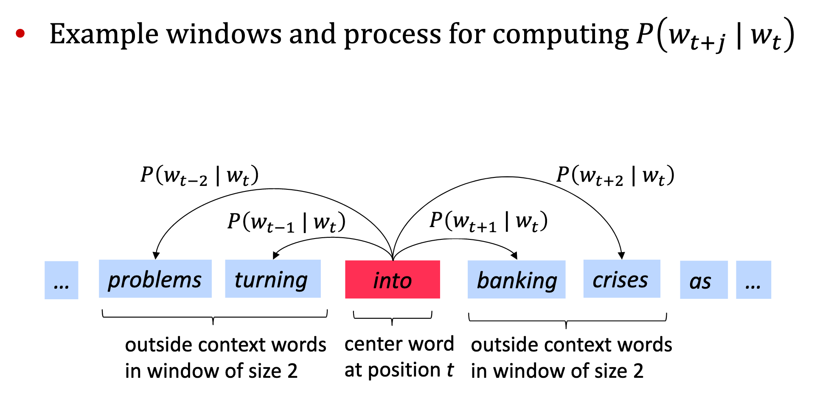
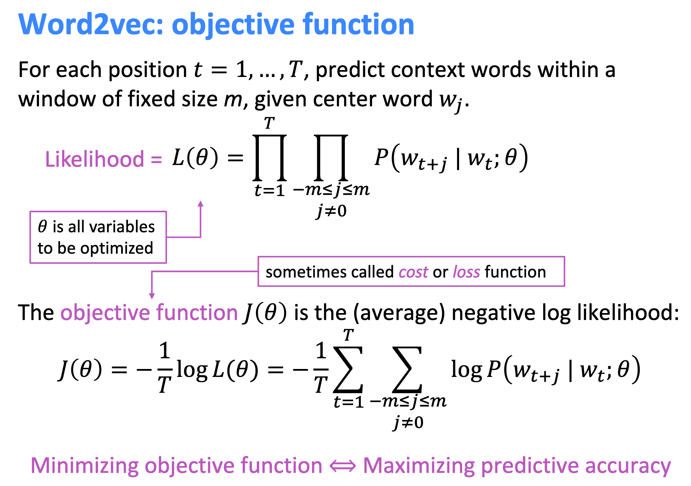

* TOC
{:toc}
---

* Course Material
    * Course [CS 224n: Nature Language Processing](http://web.stanford.edu/class/cs224n/)
    * Course [Video Link](https://www.youtube.com/watch?v=8rXD5-xhemo&list=PLfaxCAFIhb8D4EOKYc52EUw_tQUBm-vcB)

## L1 Introduction and Word Vectors

### One-Hot Encoder
* Representing word as discrete symbols
* Problem: some similar words hotel and model are orthogonal, which means that in this way these words have no relation.

### TF-IDF 
* TF (Term Frequency)

* IDF (Inverse Document Frequency)

### Representing words by their context
* Word Vectors / Word Embeddings
* Note: word vectors are sometimes called word embeddings or word representations. They are a distributed representation.

### Word2vec
* CBOW (Continuous bag-of-word model) by Mikolov et al. 2013 

