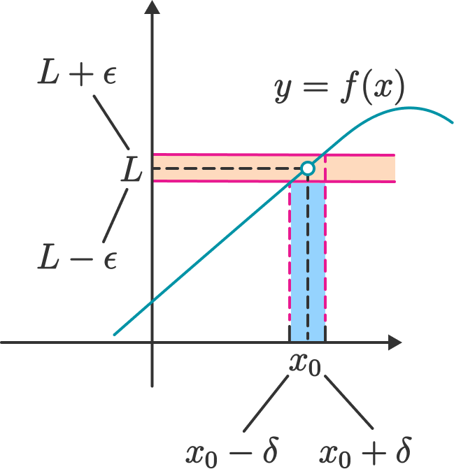

* TOC
{:toc}
---
## Calculus Basic Knowledge
* Calculus is about **differentiation** and **integration**.

## Related Materials
* [The Calculus Lifesaver - All the tools you need to excel at calculus](https://heming-zhang.github.io/course/Princeton_Calculus.pdf)

## 1 Introduction to Limits
### 1.1 Limits: The Basic Use
Let function $f$ have domain $\mathbb{R}\setminus$$\{2\}$, and set $f(x)=x-1$ on this domain. Formally, you might write:

$$f(x) = x-1\ \ \text{when}\ x\neq{2}$$

And here is a question: what is $f(2)$? If you think about it, you can see that $x$ is really colse to 2, the value of $f(x)$ is really close to 1.

Anyway, let us just write

$$\lim_{x\rightarrow{2}}{f(x)=1}$$

Or another wat of writing the above statement is

$$f(x)\rightarrow{1}\ \ \text{as}\ x\rightarrow{2}$$

If you read this out loud, it should sound like "the limit, as $x$ goes to 2, of $f(x)$ is equal to 1."

### 1.2 Limits: Definition
> Let $f$ be a function defined on some open interval that contains the number $x_0$, except possibly at $x_0$ itself. We say the limit of $f(x)$ as $x$ approaches $x_0$ is $L$, and we write
>
> $$\lim_{x\rightarrow{x_0}}{f(x)=L}$$
>
> if for every $\epsilon>0$ (no matter how small $\epsilon$ is), there exists $\delta>0$ such that for all $x$
>
> $$0<|x-x_0|<\delta\ \ \Rightarrow\   |f(x)-L|<\epsilon$$
>
 

### 1.3 Left-Hand[or Right-Hand] Limit: Definition
> Let $f$ be a function defined on some open interval $(b,x_0)\ [\text{or\ }(x_0,b)]$. We say the left-hand [or right-hand] limit of $f(x)$ as $x$ approaches $x_0$ is $L$, and we write
>
> $$\lim_{x\rightarrow{x_0^{-}}}{f(x)=L}\ \ \Big[\lim_{x\rightarrow{x_0^{+}}}{f(x)=L}\Big]$$
>
> if for every $\epsilon>0$, there exists $\delta>0$ such that
>
> $$|f(x)-L|<{\epsilon}$$
>
> whenever
>
> $$x_0-\delta<x<x_0\ \ [x_0<x<x_0+\delta]$$

### 1.4 When the Limit Does Not Exist?
> * **Infinite Limit**: If left-hand limit or right-hand limit DNE(Does Not Exist), like
>
> $$\lim_{x\rightarrow{0^{+}}}{f(x)}=\lim_{x\rightarrow{0^{+}}}{\frac{1}{x}}=+\infty $$
>
>* **Right $\neq$ Left**: If left-hand limit does not equal to right-hand limit.

* There are some interesting examples for first circumstances
    * $f(x)=\frac{1}{x}$
    * $f(x)=\frac{1}{x^2}$
    * $f(x)=\sin(\frac{1}{x})$

The above third graph is a real mess near $x=0$. It oscillates infinitely often between 1 and -1, faster and faster as you move from the right toward $x = 0$.

### 1.5 The Limit at $+\infty$ and $-\infty$
> Let $f$ be a function defined on some open interval of $(a, +\infty)\ [(-\infty, a)]$. We say the limit of $f(x)$ as $x$ approaches {negative} infinity is $L$, and we write
>
> $$\lim_{x\rightarrow{[-]\infty}}{f(x)}=L$$
>
> if for every $\epsilon>0$, there exists $N$ such that
>
> $$|f(x)-L|<\epsilon$$
>
> whenever
>
> $$x>N\ \ [x<N]$$

For example, the function $\lim_{x\rightarrow{+\infty}}{f(x)}=\lim_{x\rightarrow{+\infty}}\sin{(\frac{1}{x})}=0$

### 1.6 Properties of Limit
> * Property 1 (Uniqueness of Function Limits): If function $f$ has a limit as $x\rightarrow{x_0}$, then the limit is uniqueness for that.
> * Property 2 (Local Finiteness of Function Limit): If function $f$ has $\lim_{x\rightarrow{x_0}}{f(x)}=L$, then there exists $N>0$ and $\delta>0$ such that
>
> $$0<|x-x_0|<\delta\ \ \Rightarrow\ |f(x)|\leq{N}$$
>
> * Property 3 (Local Guarantee of Sign for Function Limit): If function $f$ has $\lim_{x\rightarrow{x_0}}{f(x)}=L$ and $L>0$ $[L<0]$, then there exists $N>0$ and $\delta>0$ such that
>
> $$0<|x-x_0|<\delta\ \ \Rightarrow\ f(x)>0\ [f(x)<0]$$
>
> * [Property 4]((https://www.bilibili.com/video/av59577023/)) (Relation Between Function and Sequence Limits): If limit $\lim_{x\rightarrow{x_0}}f(x)$ exists, $\{x_n\}$ is a sequence converges at $x_0$ ($x_n\neq{x_0}$), then corresponding function of sequence $\{f(x_n)\}$ must converge, and have
>
> $$\lim_{n\rightarrow{\infty}}f(x_n)=\lim_{x\rightarrow{x_0}}f(x)$$

> Proof of Property 4:  
> (1) Set $\lim_{x\rightarrow{x_0}}f(x)=L$, then $\forall\ {\epsilon>0}$, $\exists\ {\delta>0}$ and $0<|x-x_0|<\delta$ $\Rightarrow\ |f(x)-L|<\epsilon$  
> (2) Since $\{x_n\}$ is a sequence converges at $x_0$ ($x_n\neq{x_0}$), which equals $\lim_{n\rightarrow{\infty}}{x_n}=x_0$. It means that when $n>M$, $0<|x_n-x_0|<\delta$.  
> (3) As $x_n\neq{x_0}$, then if $n>M$ and $0<|x_n-x_0|<\delta$, then $|f(x_n)-L|<\epsilon$, meaning $\lim_{n\rightarrow{\infty}}f(x_n)=L$
>
> Self Understanding of Property 4:  
> * If $x$ approaches $x_0$ in common way ($x\rightarrow{x_0}$), $f(x)\rightarrow{A}$
> * If $x$ approaches $x_0$ in special way ($x_n\rightarrow{x_0}$), $f(x_n)\rightarrow{A}$

### 1.7 Infinite Small and Infinite Large: Definition
> * Infinite Small: If function $f$ has $\lim_{x\rightarrow{x_0}}{f(x)=0}$, then we call function $f$ is **infinite small** when $x$ approaches $x_0$.
> E.g. $\lim_{x\rightarrow{0}}{x^2}=0$, therefore, function $f$ is infinite small when $x\rightarrow{x_0}$

> * Infinite Large: Let $f$ be a function defined on some open interval that contains the number $x_0$, except possibly at $x_0$ itself. For $\forall{\ M}$, no matter how large $M$ is, there $\exists\ \delta>0$ such that
>
> $$0<|x-x_0|<\delta\ \ \Rightarrow |f(x)|>M$$
>

### 1.8 Squeeze Principle (Sandwich Principle)

 

### 1.9 An Important Limit
> $$\lim_{x\rightarrow{\infty}}(1+\frac{1}{x})^{x}=e$$

### 1.10 Comparativeness of Infinite Small
* If $\alpha,\beta$ are infinite small from same variable, and $\lim{\frac{\alpha}{\beta}}=0$, then we call $\beta$ is **higher-order infinite small** to $\alpha$. And $\lim{\frac{\alpha}{\beta}}=\infty$ for **lower-order infinite small**.

## 2 Continuity and Differentiability
### 2.0 Some Concepts
* Derivative 导数
* Derivative Function 可导函数
* Differentiable 可微 
* Differential Function 可微函数
* **Derivative** is the quotient of **Differentiation** for unary function(一元函数)： $f'(x)=\frac{dy}{dx}$

* In English environment, there is no difference on "可导" and "可微". Both of them are differentiable.  
* And notation $d$ stands for $\Delta$, meaning two infinitesimal $dy$ and $dx$.

### 2.1 Coninuity
> Let $f$ be a function defined on some open interval that contains the number $x_0$, if we have $\lim_{x\rightarrow{x_0}}{f(x)}=f(x_0)$, we will declare that function $f$ is continous at point $x_0$.

### 2.2 Differentiability
> Let $f$ be a function define on some open interval that contains the number $x_0$, we will call function $f$ is differentiate if we have limit such that
>
> $$\lim_{\Delta{x}\rightarrow0}={\frac{f(x_0+\Delta{x})-f(x_0)}{\Delta{x}}}$$  
> 
> or
>
> $$\frac{df}{dx}\bigg\vert_{x=x_0},\frac{df(x)}{dx}\bigg\vert_{x=x_0},\ f'(x_0)$$

Some examples for not differentiate  
(1) $f(x)=|x|$ when $x=0$  
(2) $f(x)=|x^2-2x|$ when $x=0, x=2$

### 2.3 Relation Between Continuity and Differentiability
> Principle: Let $f$ be a differentiable function at $x_0$, then we could assert that $f$ is continious at $x_0$. But converse proposition does not hold. 

### 2.4 Second and Higher-Order Derivatives
> * Notation: $\frac{d^n{f}}{dx^n}\big\vert_{x=x_0},\ \ f^{(n)}(x_0)$
> * Inference: $\frac{d^n{f}}{dx^n}=\frac{d}{dx}{\frac{d^{n-1}f}{dx^{n-1}}}$

  

  

Problems:  
*  术语方面通读 chapter 6， chapter 11， 罗比达（14）
*  积分（15，16，17，18，19）
*  级数（22，23，24，25，26）
*  微分方程（30）