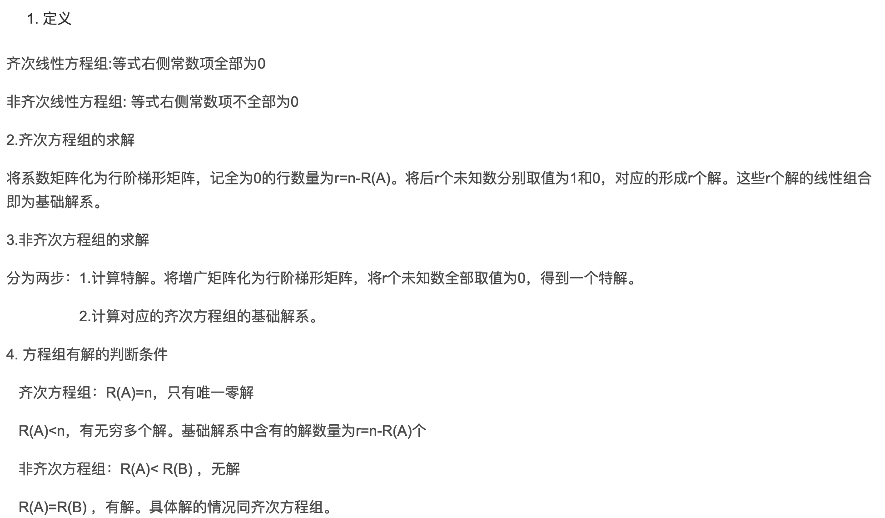

* TOC
{:toc}
---

* [Matrix Cookbook](http://www.math.uwaterloo.ca/~hwolkowi/matrixcookbook.pdf)
* [Matrix Calculus 1](https://en.wikipedia.org/wiki/Matrix_calculus)
* [Matrix Calculus 2](https://atmos.washington.edu/~dennis/MatrixCalculus.pdf)
* [Matrix Calculus 3](https://explained.ai/matrix-calculus/)

## 1.Basics Review about Linear Algebra
### 1.1 Determinat of a Matrix

* Determinat: must be square

$$
det\left[
 \begin{matrix}
   a_{11} & a_{12}\\
   a_{21} & a_{22}
  \end{matrix}
  \right]
=
\left|
 \begin{matrix}
   a_{11} & a_{12}\\
   a_{21} & a_{22}\\
  \end{matrix}
\right|
=
a_{11}a_{22}-a_{21}a_{12}
$$

 

$$
det\left[
 \begin{matrix}
   a_{11} & a_{12} & a_{13}\\
   a_{21} & a_{22} & a_{23}\\
   a_{31} & a_{32} & a_{33}
  \end{matrix}
  \right]
=
a_{11}
\left|
 \begin{matrix}
   a_{11} & a_{12}\\
   a_{21} & a_{22}\\
  \end{matrix}
\right|
-
a_{12}
\left|
 \begin{matrix}
   a_{21} & a_{23}\\
   a_{31} & a_{33}\\
  \end{matrix}
\right|
+
a_{13}
\left|
 \begin{matrix}
   a_{21} & a_{22}\\
   a_{31} & a_{32}\\
  \end{matrix}
\right|
$$

### 1.2 Matrix Sum

>* $A$ and $B$ must have the same dimensions
>* $A_{m\times{n}} + B_{m\times{n}} = C_{m\times{n}}$
>* In specific, 
>
>$$c_{ij}=a_{ij}+b_{ij}$$

### 1.3 Matrix Product

>* $C_{n\times{p}}=A_{n\times{m}}B_{m\times{p}}$
>* In specific, $c_{ij}={\sum}^{m}_{k=1}{{a_{ik}}\times{b_{kj}}}$

### 1.4 Transpose of a Matrix
>**Transpose** of matrix $A$(written $A^{T}$) is $a_{ji}$($A_{m\times{n}}$ with rows and columns flipped), where Matrix $A$ is an $m\times{n}$ element array
>
>$$
A_{m\times{n}}=\left[
 \begin{matrix}
   a_{11} & a_{12} &\cdots & a_{1n} \\
   a_{21}\\
   .\\
   .\\
   .\\
   a_{m1} &\cdots &\cdots & a_{mn}
  \end{matrix}
  \right]
$$

Some arithmetic rules for this:
>* $(A+B)^{T}=A^T+B^T$
>* $(AB)^T = B^{T}A^{T}$ 
>* If $A^T = A$, we say A is **symmertric**.

### 1.5 Inverse of a Matrix

> If A is a square matrix, the **inverse** of $A$, called $A^{-1}$, satisfies
>
>$$AA^{-1}=I\\
A^{-1}A=I$$
>
> Where $I$, the **indentity matrix**, is a diagonal matrix with all $1$' s on the diagonal, like the following matrix:
>
>$$
\left[
 \begin{matrix}
   1 & 0\\
   0 & 1\\
  \end{matrix}
\right]
$$

* Inverse of a 2D Matrix

>For a 2D matrix, if
>
>$$A=
\left[
 \begin{matrix}
   a & b\\
   c & d\\
  \end{matrix}
\right]
$$
>
>then
>
>$$A^{-1}=\frac{\left[
 \begin{matrix}
   d & -b\\
   -c & a\\
  \end{matrix}
\right]}
{|A|}
$$

* Inverse of Matrix

## 2 Linear Equation Set
### 2.1 Elementary Change of Matrix("矩阵的初等变换")

### 2.2 Rank of Matrix

### 2.3 Elementary Matrix
* Find Inverse Matrix
> Elementary Row Transformation Method for Finding Inverse Matrix:
> * Construct a matrix $(A,E)$ with $n\times{2n}$
> * Transform $(A,E)$ to $(E,A^{-1})$ with elementary row transformation

* Find Solution of Matrix Equation
> Elementary Row Transformation Method for Finding Solution of Matrix Equation $AX=B$:
> * Construct a matrix $(A,B)$ with $n\times{(n+k)}$
> * Transform $(A,B)$ to $(E,A^{-1}B)$ with elementary row transformation

### 2.4 Solution for System of Linear Equation
> Decision Therom for Judgment of Solution of Linear Equations

> Method for Solving System of Linear Equation

## 3 Linear Correlation of Groups of Vectors
### 3.1 Vector and Its Operations
### 3.2 Linear Correlation of Groups of Vectors
* Linear Correlation
> Let $A$ an group of vectors $A: \mathbf{\alpha_1, \alpha_2,\cdots,\alpha_m}$, and we will assert $A$ is **linear correlation**， if there is a set of numbers that are not all zero $k_1, k_2, \cdots, k_m$ such that
>
> $$k_1{\mathbf{\alpha_1}}+k_2{\mathbf{\alpha_2}}+\cdots+k_m{\mathbf{\alpha_m}}=\mathbf{0}$$

* Linear Dependant  
>A set of vectors is **linear dependant** if one of the vectors can be expressed as a linear combination of the other vectors.

These [**video1**](https://www.khanacademy.org/math/linear-algebra/vectors-and-spaces/linear-independence/v/linear-algebra-introduction-to-linear-independence), [**video2**](https://www.youtube.com/watch?v=yLi8RxqfowA) may explain this clearly.

Example:

$$
\left[
\begin{matrix}
  1\\
  0\\
  0
\end{matrix}
\right]
,
\left[
\begin{matrix}
  0\\
  1\\
  0
\end{matrix}
\right]
,
\left[
\begin{matrix}
  2\\
  1\\
  0
\end{matrix}
\right]
$$

### 3.3 Rank of Group Vectors

### 3.4 Structure of Solutions of Linear Equations

### 3.5 Vectors Space
> Let $V$ be a set of $n$-dimensions vectors, and $V$ is not empty. $V$ will be a vector space if for any vectors ${\mathbf{\alpha,\beta}}\in{V}$ and $k\in{\mathbb{R}}$ which satisfy
>
> $$\mathbf{\alpha+\beta}\in{V}$$
> $$k\mathbf{\alpha}\in{V}$$
>
> Those two rules are 
> * The closure of addition operation
> * The closure of number multiplication

## 4 Eigenvalue, Eigenvector, and Quadratic
### 4.1 
* Orthonornal Matrix
> Matrix $A$ is orthonornal if
>
> $$A^{T} = A^{-1}$$
>
> and in this case
>
> $$AA^{T} = I$$

* Matrix transformation

rotation matrix is given by

$$
A=
\left[
 \begin{matrix}
   cos(\theta) & -sin(\theta)\\
   sin(\theta) & cos(\theta)\\
  \end{matrix}
\right]
$$

So to rotate vector

$$
\left(
  \begin{matrix}
    1\\
    0
  \end{matrix}
\right)
$$

by 30 deg we multiply

$$
\left[
  \begin{matrix}
    0.8660 & -0.5\\
    0.5 & .08660
  \end{matrix}
\right]
\left(
  \begin{matrix}
    1\\
    0
  \end{matrix}
\right)
$$

* Matrix Transformation: Scale

### 4.2 Eigenvalue and Eigenvector

* Eigenvalues and Eigenvector
>If Matrix $A$ is a $n$ dimension square matrix, and have a number $\lambda$ and non-zero vector $X=(x_1, x_2,\cdots, x_n)^{T}$, and 
>
>$$AX = \lambda{X} \  or (\lambda{I}-A)X=0$$
>
>we will name $\lambda$ as **eigenvalue**, and name $X$ as **eigenvector**  for Matrix $A$.
>
>Therefore, the formula $(\lambda{I}-A)X=0$ can be written as following linear equations:
>
>$$
\begin{cases}
(\lambda-a_{11})x_1-a_{12}x_2-\cdots-a_{1n}x_{n}=0 \\
-a_{21}x_1+(\lambda-a_{22})x_{2}-\cdots-a_{2n}x_{n}=0\\
.\\
.\\
.\\
-a_{n1}x_1-a_{n2}x_2-\cdots+(\lambda-a_{nn})x_{n}=0
\end{cases}
$$

* Eigenvalue and Eigenvector Solving Process  
>(1)Calculate Characteristic Polynomical $|A-\lambda{E}|$  
>(2)Calculate all the solutions for $|A-\lambda{E}|$  
>(3)For every eigenvalue $\lambda_0$, calculate the basic solution $\xi_1,\cdots,\xi_{t}$ for linear homogeneous equation $(A-\lambda_0{E})x = 0$  

## 5 Other Terms

### 5.1 Trace
> Trace of a matrix is 
>
> $$Tr(A)=\sum^{N}_{i=1}a_{ii}$$
>
>which is the sum of the diagonal entries.

## 6 Matrix Calculus

* [Matrix Calculus - Wikipedia](https://en.wikipedia.org/wiki/Matrix_calculus#Layout_conventions)
### 6.1 Some General Rules
* A General Circumstance(Denominator-layout notation)
> If $\mathbf{y}\in\mathbb{R}^{m\times1}$ is an $m$-dimensions column vector, $\mathbf{x}\in\mathbb{R}^{n\times1}$ is an $n$-dimensions column vector, we have
>
> $$
\frac{\partial{\mathbf{y}}}{\partial{\mathbf{x}}}=
\left[
 \begin{matrix}
   \frac{y_1}{x_1} &\frac{y_2}{x_1} &\cdots  &\frac{y_m}{x_1}\\
   \frac{y_1}{x_2}\\
   .\\
   .\\
   .\\
   \frac{y_1}{x_n} &\frac{y_2}{x_n} &\cdots  &\frac{y_m}{x_n}
  \end{matrix}
\right]_{m\times{n}}
$$
>
> "纵向上分母维度相同，横向上分子维度相同"(Sorry for the chinese)

* Scalar Take Derivative for Vector(Denominator-layout notation)
> For $\mathbf{x}\in\mathbb{R}^{n\times1}$, $f(\mathbf{x})=y$, then we get
>
> $$\nabla_{\mathbf{x}}{f(\mathbf{x})}=\frac{\partial{f}}{\partial\mathbf{x}}=[\frac{\partial{f}}{x_1},\frac{\partial{f}}{x_2},\cdots,\frac{\partial{f}}{x_n}]^{\text{T}}$$

* Vector Take Derivative for Scalar(Denominator-layout notation)
> For $\mathbf{y}\in\mathbb{R}^{n\times1}$, $f(x)=\mathbf{y}$, then we get
>
> $$\nabla_{x}{f(x)}=\frac{\partial{f}}{\partial{x}}=[\frac{\partial{y_1}}{x},\frac{\partial{y_2}}{x},\cdots,\frac{\partial{y_n}}{x}]$$

* Matrix derivative is always a matrix