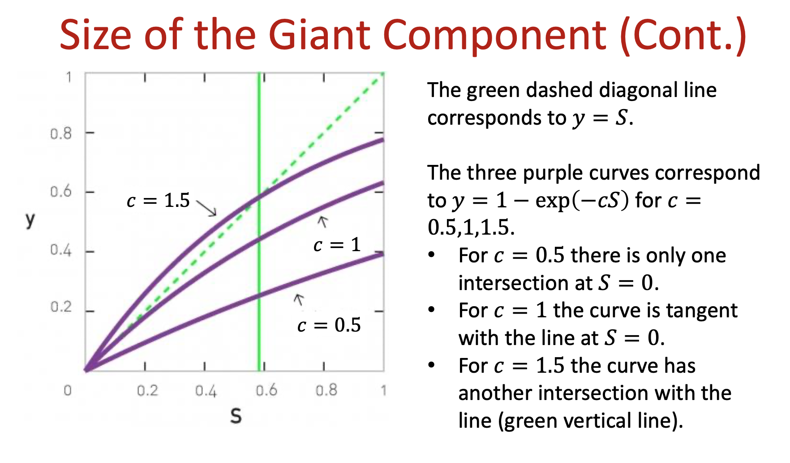

* TOC
{:toc}
---

## Chapter 2 Graph Theory

### 2.1 Degree
* Undirected Graph Average Degree, $n$ nodes, $m$ links

$$\bar{k}=\frac{1}{n}{\sum_{i=1}^{n}{k_i}}=\frac{2m}{n}$$

* Directed Graph

### 2.2 Degree Distrbution
* $n_k = \text{\#}$ of nodes with degree $k$, and $P(k)=\frac{n_k}{n}$
* Normalization condition: $\sum_{k=0}^{\infty}{p_k=1}$ or $\int_{0}^{\infty}{p(k)dk}=1$

### 2.6 Bipartite Networks
* Projections

### 2.7 Paths and Distances
* Shortest Path
* Number of Shortest Paths Between Two Nodes
* BFS Algorithm, Dijkstra for Weighted Paths

### 2.8 Connectedness
> In an undirected network, nodes $i$ and $j$ are connected if there is a path between them. 

> A network is connected if all pairs of nodes in the network are connected. A network is disconnected if there is at least one pair that is disconnnected.

* Component
> A component is a subset of nodes in a network, so that
> * there is a path between any two nodes that belong to the component
> * but one cannot add any more nodes to it that would have the same property

* Finding the Connected Components of a Network

### 2.9 Clustering Coefficient
> Local Clustering Coefficient:
> $$C_i=\frac{2L_i}{k_i(k_i-1)}$$

> Global Clustering Coefficient
> $$C_{\Delta}=\frac{3\times\text{NumberOfTriangles}}{\text{NumberOfConnectedTriples}}$$

### 2.11 Density and Sparsity
> The density of a graph is the fraction of those edges that are actually present
> $$\rho=\frac{m}{C_n^2}=\frac{2m}{n(n-1)}=<k>\frac{1}{n-1}$$

## Chapter 3 Random Networks
### 3.1 Introduction
> Historically, there were two formulations of a **random network**:  
> * $G(n,m)$ model: $n$ labeled nodes are connected with $m$ randomly placed links. 
> * $G(n,p)$ model: Each pair of $n$ labeled nodes is connected with probability $p$, a model introduced by Gilbert.

### 3.2 Number of Links in a Random Networks

> The probability that a particular realization of a random network has exactly $m$ links is:
>
> $$p_m=C_{m}^{\frac{n(n-1)}{2}}p^m(1-p)^{\frac{n(n-1)}{2}-m}$$
>
> which is a Binomial distribution.

> Then, the average number of links in a random network is
> 
> $$<m>=\sum_{m}{mp_m}=pC_{n}^2$$

> Then the average degree of a random network is then 
> $$<k>=\frac{2<m>}{n}=p(n-1)$$

### 3.3 Degree Distribution

### 3.4 Real networks are not Poisson

### 3.5 Giant Component
> We define a giant component as a network component whose size grows in proportion to $n$.

* Constant fraction: By definition, as the size of the network grows, the average size of the giant component grows with it. Hence the largest component is constant fraction of the whole network.

> Denote by $u$ the average fraction of nodes in the random graph that do not belong to the giant component.

This means that for every other node $j$ in the network, either
* (a) $i$ is not connected to $j$ by an edge or
* (b) $i$ is connected to $j$ but $j$ is not a member of the giant component

The probability of outcome (a) is simply $1-p$

The probability of outcome (b) is $pu$

Thus the probability of not being connected to the giant component via node $j$ is $1-p+pu$

Then we have

$$u=(1-p+pu)^{n-1}$$

Simplify this equation further. First we rearrange it and substitue $p=\frac{c}{n-1}$

$$u=\big(1-\frac{c}{n-1}(1-u)\big)^{n-1}$$

Taking log of both sides yields

$$\log{u}=(n-1)\log{[1-\frac{c}{n-1}(1-u)]}\approx-(n-1)\frac{c}{n-1}(1-u)\\
=-c(1-u)$$

Taking exponentials of both sides gives

$$u=exp[-c(1-u)]$$

Denote by $S$ the fraction of nodes in the giant component and then $S=1-u$, and 

$$S=1-exp(-cS)$$

#### Size of Giant Component
Depending on the value of $c$

### 3.x Small Components

## 4 Random Networks: Configuration Model

In this part, we introduce the configuration model, a more sophisticated kind of random graph which can have any desired degree distribution and yet is still exactly solvable for many properties in the limit of large network size.

### 4.1 Introduction
> The configuration model is a model of a random graph with a given degree sequence.
> A degree sequence is the set of the degrees of all nodes, {$k_1,k_2,...,k_n$}, in a network, where $k_i$ denotes the degree of node $i$.

The most widely studied of the generalized random graph models is the configuration model, an analogue of the $G(n,m)$ model.

A degree sequence contains essentially the same information as the degree distribution, as the latter represents the fraction of nodes for a given degree.

The degree sequence in turn fixes the total number of edges $m$ in the network, since

$$m=\frac{1}{2}\sum_{i}{k_i}$$

as we have discussed.

It is quite simple, however, to modify the configuration model for cases where only the degree distribution is known and not the exact degree sequence, and we will discuss it later.

### 4.2 Excess Degree Distribution

### 4.3 Clustring Coefficient

### 4.4 Locally Tree-like Networks

