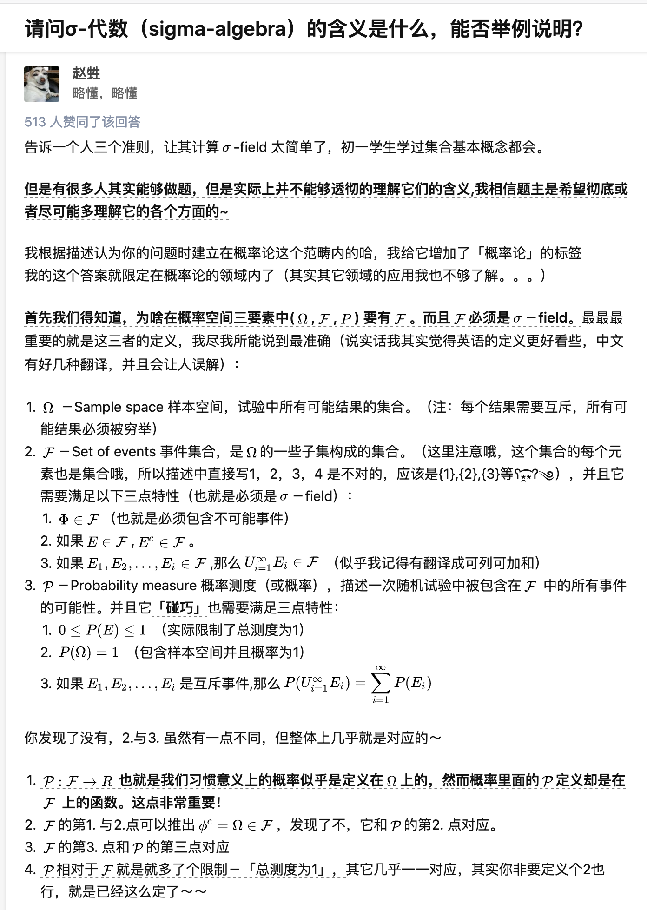
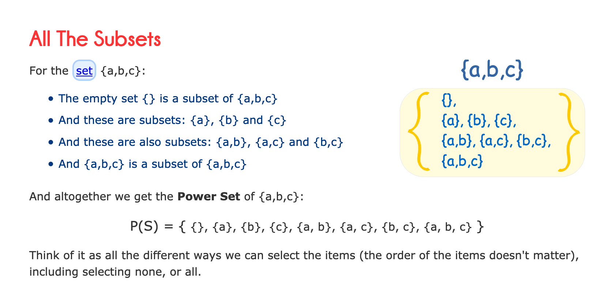
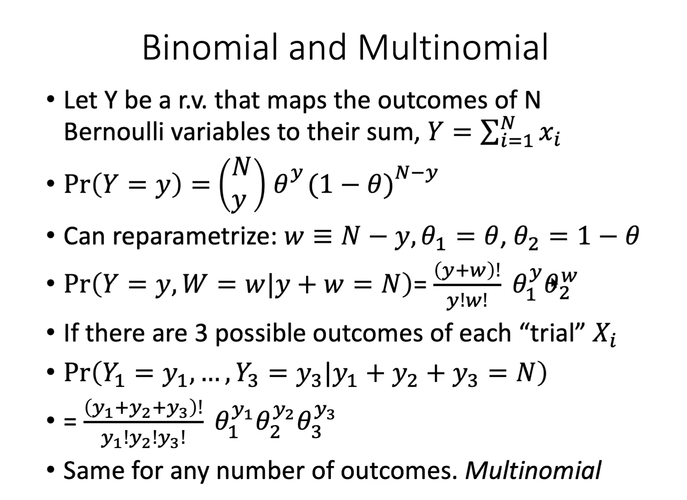

* TOC
{:toc}
---

### Sample Space

* random variable: is a function from sample space into the real numbers
* $\sigma-algebra$

* Power set

### Permutations and Combinations

* Vandermonde Identity

### Binomial and Multinomial Distribution

* connection to hypergeometric distribution: binomial is with replacement, and hypergeometric is without replacement.

### Bayes Rule

* Prior

* Posterior

* Conditional Independence

> Events $A$ and $B$ are conditional independence give $C$ if 
>
> $$P(A\cap{B}\|C)=P(A\|C)P(B\|C)$$

Example: Chess Competition, if you play chess with an opponent. It may happen that the games are conditional independent but not independent.

* Short form

> * w/o without
> * w/ with
> * b/c because

### CDF, PDF, PMF

* Cumulative Density Function
* Probability Density Function
* Probability Mass Function

### Maximum Likelihood Estimation
